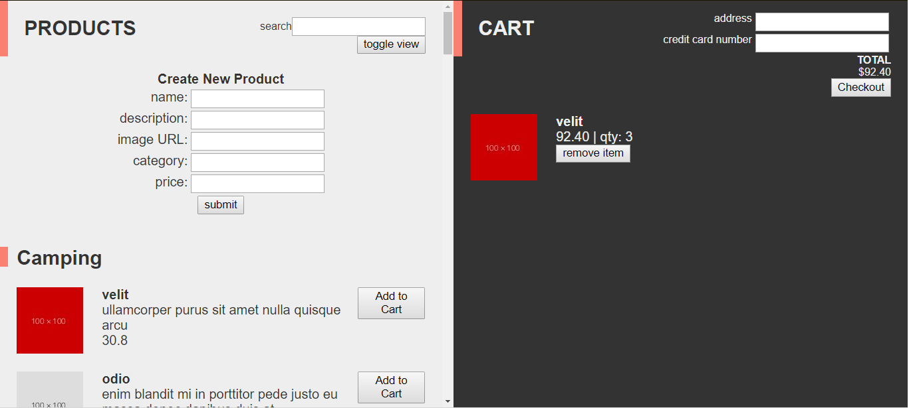

# Project Summary

In this project we will create a e-commerce React application from an start to finish. We will be provided with the basic file structure from create-react-app, but the App.js file is empty. We will be working on this app over the course of three days. Each day's project is divided into four parts, with the first part being comparable to that day's mini-project and the following parts adding more features or implementing new patterns. You should expect to be able to complete the first two parts on each day, while parts three and four will offer a challenge for 

# Day 3

Today we will be focusing on making HTTP requests using the Axios library.



## part 1

### Summary

In part 1 we will use axios to get a list of products from the server. We will be able to add products to the server. In order to access the server, we will get an API key. This needs to be applied to all http requests as a query called "key".

### Instructions

1. Refer to API docs to get an API key. Store this key on state. This will be used as a query parameter in all other requests. This should happen in componentDidMount

    <details><summary> Detailed Instructions </summary>

    Get an API key and store on state, which will be used to validate all of our HTTP requests.

    ```js
    componentDidMount() {
        axios.get('{{{BASEURL}}}'/api/key')
             .then( apiKeyRepsonse => {
                 this.setState({ apiKey: apiKeyReponse.data.apiKey })
             })
    }
    ```
    </details>

2. Once we have an API key, we need to get all products from the API. (both of these parts can happen in componentDidMount)

    <details><summary> Detailed Instructions </summary>

    Modify componentDidMount, to also hit the products endpoint, to get all products (see API documentation).

    ```js
    componentDidMount() {
        axios.get('{{{BASEURL}}}/api/key')
             .then( apiKeyResponse => {
                 axios.get('{{{BASEURL}}}/api/products?key='+apiKeyResponse.data.apiKey)
                      .then( productsResponse => {
                          this.setState({
                              apiKey: apiKeyResponse.data.apiKey,
                              products: productsResponse.data
                          })
                      })
             })
    }
    ```
    </details> 

3. We can create an AddProduct component, which will be a container of inputs, and take in a function as a parameter to be able to submit the data to the server.

    <details><summary> Detailed Instructions </summary>

    in AddProduct.js
    ```js
    import React, { Component } from 'react';

    export default class AddProduct extends Component {
        constructor(props) {
            super(props);
            this.state = {
                nameInput:'',
                descriptionInput:'',
                priceInput:'',
                imageInput:''
            }
        }
        handleName( name ){
            this.setState({
                nameInput:name
            })
        }
        handleDescription( description ){
            this.setState({
                descriptionInput:description
            })
        }
        handlePrice( price ){
            this.setState({
                priceInput:price
            })
        }
        handleImage( image ){
            this.setState({
                imageInput:image
            })
        }
        
        render() {
            const { nameInput, descriptionInput, priceInput, imageInput } = this.state;
            return (
                <div>
                    <p>Name: </p>
                    <input onChange={e => this.handleName(e.target.value)} value={nameInput}/>
                    <p>Description: </p>
                    <input onChange={e => this.handleDescription(e.target.value)} value={descriptionInput}/>
                    <p>Price: </p>
                    <input onChange={e => this.handlePrice(e.target.value)} value={priceInput}/>
                    <p>Image: </p>
                    <input onChange={e => this.handleImage(e.target.value)} value={imageInput}/>
                    <button onClick={() => this.props.addProduct({name:nameInput, description:descriptionInput, price:priceInput, image:imageInput})}>Submit</button>
                </div>
            );
        }
    }
    ```

4. Now create a submit function to be passed in to this component, that will submit a new product to the API. Refer to the API documentation for the type of request and URL. This function should update products on state with the resulting value.

    <details><summary> Detailed Instructions </summary>

    in App.js
    ```js
    addProduct( product ) {
    axios.post('{{{BASEURL}}}/api/products?key='+this.state.apiKey, product)
        .then( response => this.setState({ products: response.data }))
    }
    ```

    </details>

5. Import AddProduct into App.js, and give it the prop of `this.addProduct`. Bind the addProduct method on App in the constructor function. 

    <details><summary> Detailed Instructions </summary>

    Import the AddProduct component into App.js
    ```js
    import AddProduct from './components/AddProduct';

    // in constructor
    this.addProduct = this.addProduct.bind(this);

    // in render method
    <AddProduct addProduct={this.addProduct}/>
    ```
    </details>

## Part 2

### Summary

In this part we will be changing up the way we handle the cart. All the cart will be stored on the server, and we will have to use HTTP requests to add or remove items from the cart. 

### Instructions

1. `addToCart` should be refactored to make an axios post to the appropriate endpoint (see API docs).

    <details><summary> Detailed Instructions </summary>
    Let's refactor our `addToCart` method to use axios and send the request to the API

    ```js
    addToCart( item ) {
    axios.post(`{{{BASEURL}}}/api/products/${item}?key=${this.state.apiKey}`)
        .then(response => this.setState({ cart: response.data }))
    }
    ```
    </details> 

2. `removeFromCart` should be refactored to make an axios request. Again, refer to the API docs on which enpoint to hit and how to format the request. 

    <details><summary> Detailed Instructions </summary>
    
    Refactoring `removeFromCart`.
    ```js
    removeFromCart( item ) {
    axios.delete(`{{{BASEURL}}}/api/products/${item}?key=${this.state.apiKey}`) {
        .then(response => this.setState({ cart: response.data }))
    }
    }
    ```
    </details> 

## Part 3 


### Summary

In this part we will create a reusable button component, and then replace all of the buttons in our app with this component. 

### Instructions

1. Create a Button.jsx file and create a functional component in this file as the default export. 

    <details><summary> Detailed Instructions </summary> 

    in Button.js
    ```js
    import React from 'react'
    import propTypes from 'prop-types'

    function Button (props) {
        
    }

    Button.propTypes = {
        handleClick: propTypes.func.isRequired,
        text: propTypes.string.isRequired
    }

    export default Button
    ```
    </details>

2. This component should take two props, for the button text and onclick function.

    <details><summary> Detailed Instructions </summary>

    in Button.js
    ```js
    function Button (props) {
        return <button onClick={props.handleClick}>{props.text}</button>;
    }
    ```
    </details> 

## Part 4 

### Summary

In this part we will be refactoring our search function to query the API and render the results. We will also be using the payment API to process user payments. 

### Instructions

1. Add a button under the search input box that will activate the handleSearch method

    <details><summary> Detailed Instructions </summary> 

    ```js
    <button handleClick={this.handleSearch}> search </button>
    ```
    </details>

2. Change the handleSearch method to do a get request to the api for the products with the query parameter of the user search input. Then filter the results onto category arrays to be stored on state.  

    <details><summary> Detailed Instructions </summary>
    handleSearch method  in App.js
    ```js
    handleSearch() {
        axios.get('{{{BASEURL}}}/products/catalog?key='+this.state.apiKey+'&name='+this.state.searchInput)
             .then(productsResponse => {
                // filter results onto arrays
                let camping = productsResponse.data.filter(item=> item.category==="camping");
                let candy = productsResponse.data.filter(item => item.category === "candy");
                let clothing = productsResponse.data.filter(item => item.category === "clothing");
                let food = productsResponse.data.filter(item => item.category === "food");
                // set these values on state
                this.setState({
                    camping, candy, clothing, food
                })
             })
    }
    ```
    </details>

3. Make sure to have an onChange method for the search input box that will update its value on state.

    <details><summary> Detailed Instructions </summary>
    Search input box
    ```js
    <input type="text" 
           value={this.state.searchInput}
           onChange={event=>this.setState({searchInput:event.target.value})} />
    ```
    </details>

4. We can change our maps because the filtering will be done by the api.

    <details><summary> Detailed Instructions </summary>

    ```js
    { this.state.camping.map(item => {
        return <Product item={item} addToCart={this.addToCart}
                        toggleView={this.state.toggleView} />
    })}
    ```
    </details>

5. In order to use the Payment API, we will need to request a seperate api key. 

    <details><summary> Detailed  Instructions </summary> 

    In App.js, componendDidMount
    ```js
    axios.get('{{{PAYMENT API BASEURL}}}/payment/key)
         .then( apiKeyResponse => {
             this.setState({ paymentApiKey: apiKeyResponse.data.apiKey })
         })
    ```
    </details> 

6. Then, in our checkout method, we will use an axios post to send the cart to the payment API. 

    <details><summary> Detailed Instructions </summary>

    In App.js, modify the checkout method. 
    ```js
    checkout() {
        if (!this.state.addressInput || !this.state.ccInput){
            alert("Fill out required fields first.");
        } else if (this.state.cart.legnth===0) {
            alert("Cart is empty.");
        } else {
            axios.post('{{{PAYMENT API BASEURL}}}/payment/transactions?key='+this.state.paymentApiKey, this.state.cart)
            axios.delete("{{{PRODUCTS API BASEURL}}}/products/cart/checkout?key="+this.state.apiKey).then(checkoutResponse => {
                this.setState({
                    cart: checkoutResponse.data,
                    addressInput: "",
                    ccInput: ""
                })
            })
        }
    }
    ```
    </summary> 
    